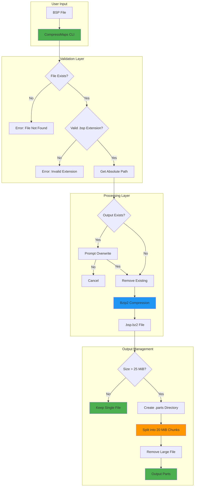
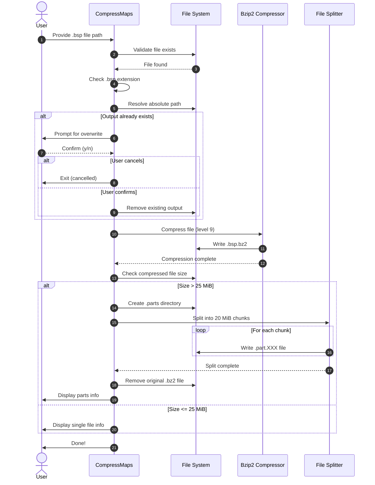
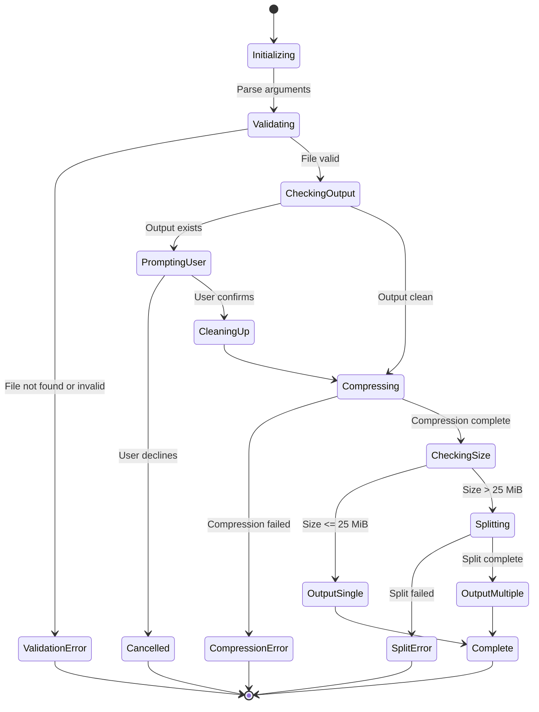

# CompressMaps

A Go utility to compress Team Fortress 2 BSP map files using bzip2 compression and automatically split large files into manageable chunks for distribution.

[](https://golang.org/)
[](LICENSE)

## Overview

CompressMaps is a command-line tool designed to streamline the distribution of Team Fortress 2 custom maps by compressing BSP files using bzip2 and intelligently splitting them when necessary. Many TF2 server operators and map creators need to share large map files, and the Source engine's FastDL system benefits from compressed and appropriately sized chunks.

The tool uses high-quality bzip2 compression (level 9) to achieve optimal file size reduction while maintaining compatibility with Source engine map distribution systems. When compressed files exceed typical server limits (25 MiB), the tool automatically splits them into 20 MiB chunks that can be hosted and downloaded separately, then recombined by clients.

Built in Go for cross-platform compatibility, CompressMaps provides a simple, efficient solution for map file preparation with user-friendly features like colored terminal output, interactive confirmations, and drag-and-drop support.

### Key Responsibilities

- **Compress**: Applies bzip2 compression (level 9) to BSP files, significantly reducing file size for faster downloads
- **Validate**: Ensures input file exists, has the correct `.bsp` extension, and handles absolute path resolution
- **Split**: Automatically divides compressed files exceeding 25 MiB into 20 MiB chunks with sequential naming
- **Manage**: Provides interactive overwrite confirmation, organized output directory structure, and clear progress feedback

## Architecture



## How It Works

### File Processing Flow



### Application State Machine



## Features

- **Bzip2 Compression**: Uses maximum compression level (9) for optimal file size reduction, typically achieving 40-60% compression on BSP files
- **Automatic Splitting**: Intelligently splits files exceeding 25 MiB threshold into 20 MiB chunks with sequential naming (.part.000, .part.001, etc.)
- **Interactive Overwrite Protection**: Prompts users before overwriting existing compressed files or part directories, preventing accidental data loss
- **Colored Terminal Output**: Uses ANSI color codes (green/yellow/red) for clear visual feedback on operations, warnings, and errors
- **Cross-Platform Support**: Compiles and runs on Linux, Windows, and macOS with platform-specific executable builds
- **Drag-and-Drop Support**: Accepts files through drag-and-drop on compatible platforms (Windows, some Linux DEs) for ease of use
- **Absolute Path Resolution**: Automatically resolves relative paths to absolute paths to avoid ambiguity in file operations
- **Detailed Progress Reporting**: Shows compression progress, file sizes in MiB, part counts, and lists all created files
- **Clean Output Organization**: Creates organized .parts directories for split files, keeping related chunks together
- **Error Handling**: Comprehensive error checking with descriptive messages for all failure scenarios

## Prerequisites

- Go 1.21 or higher (for building from source)
- Linux, Windows, or macOS operating system
- Sufficient disk space for compressed output (typically 40-60% of original BSP size)

## Installation

### Option 1: Download Pre-built Binaries

Download the latest release from the [Releases](https://github.com/UDL-TF/CompressMaps/releases) page:

- **Linux**: `compressmaps-linux`
- **Windows**: `compressmaps.exe`

Make the binary executable (Linux/macOS):
```bash
chmod +x compressmaps-linux
```

### Option 2: Build from Source

```bash
# Clone the repository
git clone https://github.com/UDL-TF/CompressMaps.git
cd CompressMaps

# Download dependencies
go mod download

# Build the executable
go build -o compressmaps

# Or build for specific platforms
# Linux
GOOS=linux GOARCH=amd64 go build -o compressmaps-linux

# Windows
GOOS=windows GOARCH=amd64 go build -o compressmaps.exe

# macOS
GOOS=darwin GOARCH=amd64 go build -o compressmaps-macos
```

## Usage

### Command Line

```bash
./compressmaps <map_file.bsp>
```

### Examples

```bash
# Compress a single map
./compressmaps pl_upward.bsp

# Using absolute path
./compressmaps /path/to/maps/cp_dustbowl.bsp

# Compress a large map (will auto-split)
./compressmaps bhop_arcane_v1_fix1.bsp
```

### Drag and Drop

You can drag and drop a `.bsp` file onto the executable on Windows and some Linux desktop environments.

### Output

**For files under 25 MiB:**
```
Compressing pl_upward.bsp to bzip2...
✓ Created /path/to/pl_upward.bsp.bz2
Compressed size: 18 MiB
✓ File size is within threshold, no splitting needed
Done!
```

**For files over 25 MiB:**
```
Compressing bhop_arcane_v1_fix1.bsp to bzip2...
✓ Created /path/to/bhop_arcane_v1_fix1.bsp.bz2
Compressed size: 74 MiB
File exceeds 26214400 bytes threshold
Splitting into 20 MiB chunks...
✓ Split into 4 part(s) in /path/to/bhop_arcane_v1_fix1.bsp.bz2.parts
Parts created:
  bhop_arcane_v1_fix1.bsp.bz2.part.000 (20971520 bytes)
  bhop_arcane_v1_fix1.bsp.bz2.part.001 (20971520 bytes)
  bhop_arcane_v1_fix1.bsp.bz2.part.002 (20971520 bytes)
  bhop_arcane_v1_fix1.bsp.bz2.part.003 (14709734 bytes)
Done!
```

## Configuration

### Constants (main.go)

The following constants can be modified in [main.go](main.go) before building:

| Constant              | Description                                            | Default             | Type    |
| --------------------- | ------------------------------------------------------ | ------------------- | ------- |
| `splitThresholdBytes` | Size threshold for triggering automatic file splitting | `26214400` (25 MiB) | `int64` |
| `splitChunkSize`      | Size of each chunk when splitting files                | `20971520` (20 MiB) | `int64` |

### Color Codes (main.go)

ANSI color codes can be modified if needed:

| Constant      | Description      | Default      |
| ------------- | ---------------- | ------------ |
| `colorRed`    | Error messages   | `\033[0;31m` |
| `colorGreen`  | Success messages | `\033[0;32m` |
| `colorYellow` | Warning messages | `\033[1;33m` |
| `colorReset`  | Reset to default | `\033[0m`    |

## Development

### Project Structure

```
CompressMaps/
├── main.go                    # Main application with compression and splitting logic
├── go.mod                     # Go module definition with dependencies
├── go.sum                     # Dependency checksums
├── README.md                  # This file
├── LICENSE                    # License file
├── .gitignore                 # Git ignore rules
└── .github/
    └── workflows/
        └── release.yml        # GitHub Actions workflow for releases
```

### Building

```bash
# Build for current platform
go build -o compressmaps

# Build with optimizations (smaller binary)
go build -ldflags="-s -w" -o compressmaps

# Build for all platforms
make release  # (if Makefile exists)
```

### Testing

```bash
# Create a test BSP file (dummy)
dd if=/dev/urandom of=test_map.bsp bs=1M count=50

# Run the tool
./compressmaps test_map.bsp

# Clean up
rm -rf test_map.bsp test_map.bsp.bz2*
```

## License

See [LICENSE](LICENSE) file for details.

## Dependencies

- [dsnet/compress](https://github.com/dsnet/compress) - High-performance bzip2 compression library for Go with writer support
